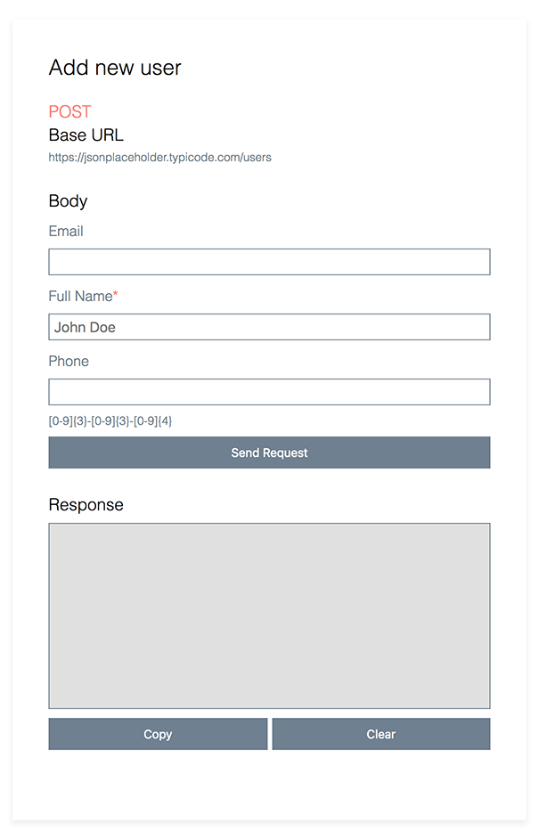

### Instructions
The [App.js](./src/App.js) file imports several configurations from [configs.js](./src/configs.js). To specify a config:
```
const { title, url, method, body } = YOUR CONFIG;
```
To render the [ExplorerComponent](./src/components/ExplorerComponent.js) pass in the parameters from the config:
```
<ExplorerComponent url={url} method={method} body={body} />
```

You should get something like this:



Let me know if you have any questions!
